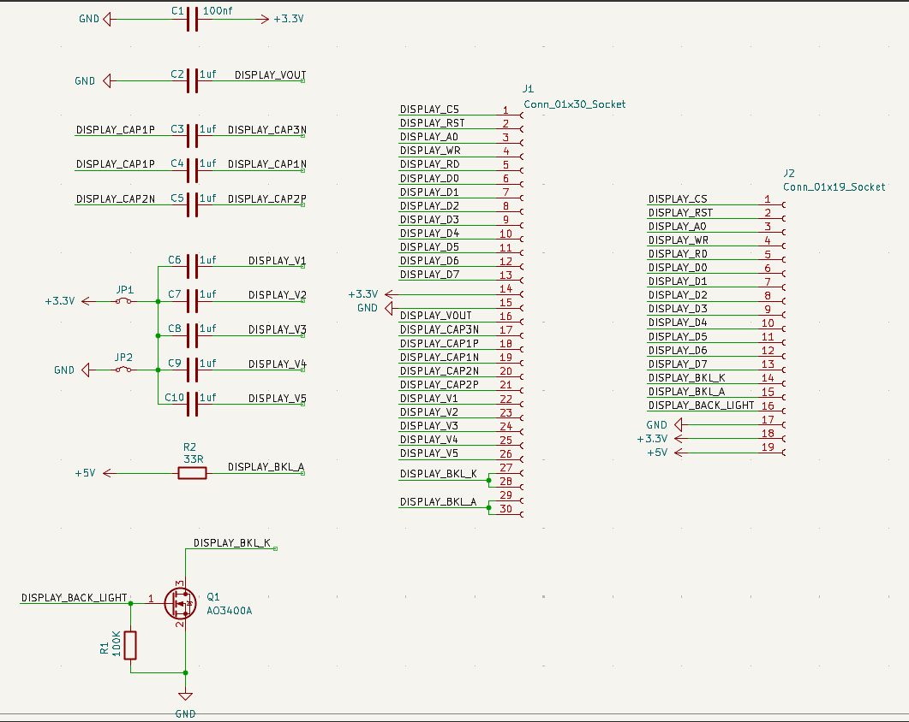
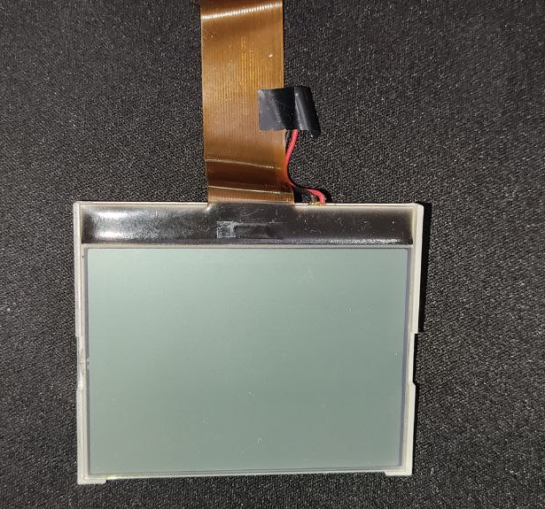
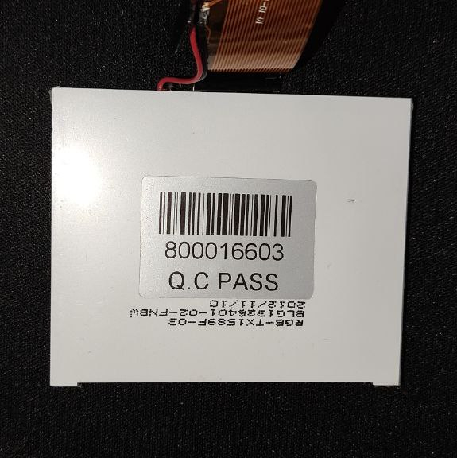

# Arduino SPLC501C LCD Driver (GS-GG1326402FFYJ-R)

## Overview

This project involves using the ESP32-S module to drive a second-hand SPLC501C (GS-GG1326402FFYJ-R) LCD Driver. The goal is to reverse engineer the LCD pinout to set up the display and create functions that initialize the display, show various icons (such as message, signal strength, battery, etc.) in the icon bar section, and display text in the main area of the LCD.

## Features

- Initialization of the SPLC501C LCD
- Display of icons in the icon bar (message, signal strength, battery, etc.)
- Display of text in the main area of the LCD
- Custom 5x8 font support

## Hardware Requirements

- ESP32-S module
- SPLC501C driver LCD
- Breadboard and jumper wires
- Power supply (as required by the ESP32-S and LCD)

## Schematic

The SPLC501C LCD has a specific schematic that must be followed for proper operation. Please refer to the schematic diagram below for wiring instructions. Ensure that all connections are secure and correctly oriented.



## Installation

1. **Clone the Repository:**
   ```bash
   git clone https://github.com/reza-bakhshi/Arduino-SPLC501C-LCD-Driver-GS-GG1326402FFYJ-R-.git
   ```

2. **Upload the Code:**
   Open the project in PlatformIO within the VSCode editor and upload the code to your ESP32-S module.

## Usage

1. **Power On:**
   Connect the power supply to the ESP32-S and the SPLC501C LCD.

2. **Run the Program:**
   Once the code is uploaded, the ESP32-S will initialize the LCD and display the icons and text as programmed.

3. **Customization:**
   You can modify the code to change the displayed icons and text according to your requirements.

## Photos





See more photos in the [Images](images) directory.

## Contributing

If you would like to contribute to this project, feel free to fork the repository and submit a pull request. Any improvements or additional features are welcome!

## License

This project is licensed under the MIT License. See the [LICENSE](LICENSE) file for more details.